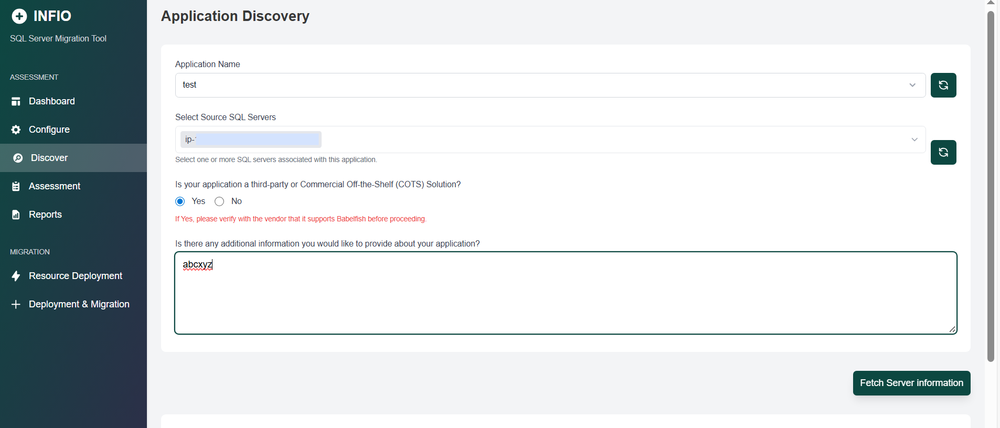

# INFIO Documentation

# Table of Contents

- [Solution Overview](#solution-overview)
  - [Multi Assessment Approach](#multi-assessment-approach)
    1. [SQL Server to Babelfish](#1-sql-server-to-babelfish-for-aurora-postgresql-assessment)
    2. [SQL Server to Aurora PostgreSQL Assessment](#2-sql-server-to-aurora-postgresql-assessment)
    3. [NET Application to .NET Core Migration Assessment](#3-net-application-to-net-core-migration-assessment)
- [Purpose of This Document](#purpose-of-this-document)
- [Target Audience](#target-audience)
- [INFIO Assessments Report covers](#infio-assessments-report-covers)
- [Use Cases](#use-cases)
- [Concepts and Definitions](#concepts-and-definitions)
- [Architecture Overview](#architecture-overview)
  - [Components](#components)
- [AWS Well-Architected Design Considerations](#aws-well-architected-design-considerations)
- [AWS Services in this Solution](#aws-services-in-this-solution)
- [Rotating Programmatic Credentials and Cryptographic Keys](#rotating-programmatic-credentials-and-cryptographic-keys)
- [Cost](#cost)
- [Security](#security)
  - [IAM Roles](#iam-roles)
  - [AWS VPC Endpoints](#aws-vpc-endpoints)
  - [Instance Metadata Service (IMDS)](#instance-metadata-service-imds)
- [Supported AWS Regions](#supported-aws-regions)
- [AWS CloudFormation Quotas](#aws-cloudformation-quotas)
- [Prerequisites](#prerequisites)  
  - [1. Skillsets](#1-skillsets)  
  - [2. Verify IAM role permissions after deploying INFIO EC2 instance](#2-verify-iam-role-permissions-after-deploying-infio-ec2-instance)
- [Deployment steps of INFIO EC2 instance](#deployment-steps-of-infio-ec2-instance)
  - [1. Deployment of EC2 instance from INFIO AMI(AWS Marketplace)](#1-deployment-of-ec2-instance-from-infio-amiaws-marketplace)
  - [2. Log in to a Windows INFIO EC2 Instance in a Private Subnet Using a Bastion Host (Optional)](#2-log-in-to-a-windows-infio-ec2-instance-in-a-private-subnet-using-a-bastion-host-optional)
  - [3. VPC Endpoint Deployment for CloudFormation Service (Optional)](#3-vpc-endpoint-deployment-for-cloudformation-service-optional)
  - [4. VPC Endpoint Deployment for S3, Secret manager, KMS, EC2, DMS, RDS, and IAM and security group for all VPC endpoints (Optional)](#4-vpc-endpoint-deployment-for-s3-secret-manager-kms-ec2-dms-rds-and-iam-and-security-group-for-all-vpc-endpoints-optional)
  - [5. Steps for setting up AWS Resources for INFIO EC2 instance](#5-steps-for-setting-up-aws-resources-for-infio-ec2-instance)
  - [6. Required SQL Server Database Permissions for Running the INFIO Tool](#6-required-sql-server-database-permissions-for-running-the-infio-tool)
  - [7. Update Environment Variables for Multiple Deployments of INFIO EC2 Instace (Optional)](#7-update-environment-variables-for-multiple-deployments-of-infio-ec2-instace-optional)
- [INFIO Assessment Tool Usage Guide](#infio-assessment-tool-usage-guide)
  - [Infio Dashboard Overview](#infio-dashboard-overview)
  - [Configuration Page Setup](#configuration-page-setup)
  - [Application Discovery](#application-discovery)
  - [Steps to Perform Assessment in INFIO](#steps-to-perform-assessment-in-infio)
    - [SQL Server to Babelfish](#1-sql-server-to-babelfish)
    - [SQL Server to Aurora PostgreSQL](#2-sql-server-to-aurora-postgresql)
    - [.NET Assessment](#3-net-assessment)
  - [Generating the Summary Report](#generating-the-summary-report)
  - [Export Server Metrics](#export-server-metrics)
- [Monitoring](#monitoring)
- [Recovery and Backup](#recovery-and-backup)
- [Managing Licenses](#managing-licenses)
- [Technical Support & Emergency Maintenance](#technical-support--emergency-maintenance)
- [FAQs](#faqs)


---
### Solution Overview

INFIO is a specialized tool developed by Cornerstone Consulting Group to streamline and automate the database and application migration assessment process in AWS. It provides a comprehensive evaluation of migration feasibility, covering SQL Server to Babelfish for Aurora PostgreSQL, SQL Server to Aurora PostgreSQL, and .NET applications migrating to .NET Core. Unlike traditional assessment tools that focus primarily on code compatibility, INFIO takes a migration-centric approach, offering detailed insights into compatibility, conversion efforts, and potential challenges across databases and application stacks.

### Multi Assessment Approach

INFIO runs three distinct assessments to facilitate different migration scenarios:
1. SQL Server to Babelfish
2. SQL Server to Aurora PostgreSQL Assessment
3. .NET Application to .NET Core Migration Assessment

#### 1. SQL Server to Babelfish

INFIO generates a Database Migration Assessment Report that evaluates the compatibility of SQL Server with Babelfish for Aurora PostgreSQL. The report provides an overall compatibility summary, categorizing features as fully supported, conditionally supported, or unsupported. It includes a detailed compatibility analysis using charts to visualize database schema and application code compatibility. Additionally, it breaks down database-level compatibility, highlighting support levels for each database. 

The report identifies non-supported features, suggests workarounds, and estimates the effort required for necessary modifications. It also highlights conditionally supported features that require manual review before migration. Beyond standard assessments, the report detects additional compatibility issues and filters out non-essential features for clarity. It further identifies database objects needing conversion, evaluates DMS compatibility concerning recovery models, data types, tables, and backup configurations, and highlights potential migration challenges such as missing primary keys. Also, it maps database object dependencies to ensure structural integrity. Lastly, it compares cost estimates for different deployment models, helping businesses optimize infrastructure and licensing expenses.  which is comprehensive assessment for a seamless migration process.


#### 2. SQL Server to Aurora PostgreSQL Assessment

This database migration report is the report it generates to facilitate schema transformation. This database migration assessment report summarizes all schema conversion tasks and provides detailed action items for database objects that cannot be converted automatically.

The migration assessment report includes:
- An Executive Summary.
- Recommendations, including conversion of server objects, backup strategies, and linked server modifications.
- Effort Estimates, showing the work required to manually rewrite database elements that are incompatible with Aurora PostgreSQL.


#### 3. .NET Application to .NET Core Migration Assessment

INFIO also facilitates the migration of .NET applications  to .NET Core for .NET. This tool scans .NET projects, analyzes source code and package dependencies, and generates an assessment report that highlights incompatible APIs and NuGet/Microsoft Core packages.

Key aspects of the .NET assessment report includes:
- Analysis of Project and Package Compatibility.
- Detection of Incompatible or Deprecated APIs.
- Migration Guidance for Third-Party Dependencies.
- Effort Estimation for Porting Tasks.
- Automated conversion of .NET project references to their .NET Core equivalent with updated package details

The solution provides deep insights into the existing database environment while adhering to **AWS best practices** for cloud migration. It emphasizes **security**, **scalability**, **reliability**, and **cost optimization** throughout the process.

---

### Purpose of This Document
This user guide provides comprehensive instructions for deploying and using the **INFIO Tool**. It covers:

- Necessary prerequisites
- Step-by-step deployment procedures
- Usage guidelines
- Troubleshooting tips
- Frequently asked questions

---

### Target Audience
This guide is intended for:

- **IT professionals**
- **Database administrators**
- **Cloud engineers**
- **.NET developers**

who are responsible for assessing database compatibility and .NET applications for migration purposes.

--- 

### INFIO Assessments Report covers

INFIO runs three distinct assessments to facilitate different migration scenarios and provide comprehensive analysis and reports tailored to each target environment: 
1. SQL Server to Babelfish
2. SQL Server to Aurora PostgreSQL Assessment
3. .NET Application to .NET Core Migration Assessment

#### 1.  SQL Server to Babelfish

- **Overall Compatibility Evaluation**  
  Determines the **percentage of fully supported, conditionally supported, and unsupported features**, assessing how much modification is required for migration.  

- **Schema & Application Code Compatibility**  
  Analyzes compatibility using **visual charts** to represent conversion efforts.  

- **Database-Level Compatibility Breakdown**  
  Evaluates **each database's support level**, highlighting potential migration challenges.  

- **Non-Supported Features Analysis**  
  Identifies **unsupported SQL Server features**, such as system procedures, DML/DDL statements, transactions, and catalogs, along with **workarounds and estimated effort levels**.  

- **Conditionally Supported Features**  
  Highlights features that require **manual review**, including **primary key constraints, indexing issues, and stored procedures**.  

- **Additional Compatibility Issues**  
  Detects additional compatibility issues related to data types and data migrations. 

- **Assessment Exclusions**  
  This process selectively excludes T-SQL compatibility issues deemed non-essential, thereby concentrating resources on the resolution of **core discrepancies**.

- **Database Objects Requiring Conversion**  
  Lists **database objects that need modifications**, helping in migration planning.  

- **DMS Compatibility Assessment**  
  Examines **AWS Database Migration Service (DMS) compatibility**, evaluating **unsupported recovery models, table structures, backup strategies, and encryption concerns**.  

- **Potential Migration Issues**  
  Highlights **structural issues such as missing primary keys** and provides **workarounds to ensure data integrity**.  

- **Database Object Dependencies**  
  Maps dependencies between **tables, views, stored procedures, and sequences** to prevent data integrity issues.  

- **Total Cost of Ownership (TCO) Analysis**  
  Determines infrastructure TCO by evaluating migration path and **deployment pattern variances**, omitting secondary cost considerations. 

#### 2. SQL Server to Aurora PostgreSQL Assessment

- **Schema Transformation Summary**  
  Provides a high-level overview of schema conversion tasks required for migration.

- **Executive Summary**  
  Presents conversion readiness, key findings, and compatibility metrics.

- **Unsupported Object Identification**  
  Lists objects (functions, triggers, stored procedures, etc.) not directly convertible to Aurora PostgreSQL.

- **Manual Conversion Effort Estimation**  
  Estimates manual effort required to rewrite incompatible SQL Server objects.

- **Conversion Recommendations**  
  Offers alternatives for features like linked servers, table hints, and special indexes.

- **Detailed Object Conversion Report**  
  Breaks down compatibility for tables, constraints, sequences, indexes, and views.

- **Dependency Mapping**  
  Ensures integrity by mapping dependencies between related objects.

- **Backup & Recovery Model Analysis**  
  Reviews backup models and suggests Aurora PostgreSQL-compatible alternatives.

- **DMS Integration Readiness**  
  Validates AWS DMS support and flags configuration blockers.

#### 3. .NET Application to .NET Core Migration Assessment

- **API & Package Compatibility Analysis**  
  Identifies incompatible .NET Framework APIs and NuGet packages not supported in targeted .NET Core versions.

- **Replacement Component Suggestions**  
  Recommends suitable .NET Core alternatives for deprecated or unsupported libraries.

- **Unknown Features Detection**
  Identifies unknown features that not migrated directly to targeted .NET core versions. 

- **Unsupported Component Detection**  
  Highlights elements that cannot be migrated directly and require manual intervention.

- **Manual Effort Estimation**  
  Provides effort estimates for code changes needed to achieve full compatibility.

- **Project File Conversion Automation**  
  Converts .NET Framework project references to .NET Core format with updated package details.

---

### Use Cases
INFIO can be used to:

- **Assess large-scale heterogeneous database & .NET application migrations**: Enable a single-pane-of-glass view for large-scale database workload migration assessments.
- **Provide prebuilt automation and reporting**: Utilize role-based access via a single web interface designed specifically for migration assessments.

---

### Concepts and Definitions
This section describes key concepts and defines terminology specific to this solution:

- **INFIO AMI**: Prebuilt Amazon Machine Image hosting INFIO tool and services.
- **Stack**: CloudFormation stack used for AWS resource deployment.
- **Application**: A group of resources that make up a single business service or application.
  - **Server**: Source database server to be assessed.
  - **Database**: Source database to be assessed.

---

### Architecture Overview


#### Components:
- **AMI**: The INFIO AMI, a pre-configured, Windows-based Amazon Machine Image (AMI) available on AWS Marketplace, can be used to rapidly deploy EC2 instances equipped with the necessary tools and scripts for implementing the INFIO assessment solution.
- **Amazon S3**: Used for storing input files prior to assessments and output files following the assessment process.
- **Secret Manager**: Used as a repository for storing database credentials required to connect to databases.
- **Key Management Services**: Serves as a secure storage location for encryption keys used to protect resources during INFIO deployments.
- **CloudFormation Stack**: Used for automated deployments of AWS resources.
- **VPC Endpoints (Optional)**:  Use VPC Endpoints for private, secure access to AWS services without internet exposure. 
  - Optional if your INFIO EC2 is in a public subnet or has a NAT Gateway.
  - Required if your INFIO EC2 is in a private subnet (no internet access) and needs AWS service access.
Without a VPC Endpoint, a private INFIO EC2 instance must use a NAT Gateway (extra cost) or be moved to a public subnet.
- **DMS**: DMS is generating assessment report that it generates to help you convert your schema. This database migration assessment report summarizes all of the schema conversion tasks. It also details the action items for schema that can't be converted to the DB engine of your target DB instance of Aurora postgreSQL. 

---

### AWS Well-Architected Design Considerations:

| Pillar                     | Design Consideration                                                                                                  |
|----------------------------|----------------------------------------------------------------------------------------------------------------------|
| **Operational Excellence** | Resources defined as Infrastructure as Code using CloudFormation.                                                   |
| **Security**               | IAM used for authentication and authorization, with narrowly scoped role permissions. VPC endpoints are used for private communication. |
| **Reliability**            | This is an AMI-based solution, and a new preconfigured EC2 instance can be provisioned quickly in case of any failure. |
| **Performance Efficiency** | Right-sizing EC2 instance types and sizes to align with the assessment workload.                                     |
| **Cost Optimization**      | EC2 lifecycle management and right-sizing help reduce costs.                                                         |
| **Sustainability**         | The INFIO Plugin streamlines input file gathering, reducing EC2 runtime. Effective EC2 instance lifecycle management further minimizes resource consumption. |

---

#### AWS Services in this Solution
- **Amazon VPC (Core)**: Provides the underlying network infrastructure to securely connect EC2 instances and other AWS services, including VPC endpoints for private access to resources like S3, KMS, and Secrets Manager.
- **Amazon EC2 (Core)**: Provides scalable compute resources for running INFIO tool or services within the VPC. Instances in private subnets securely access AWS services via VPC endpoints.
- **Amazon S3 (Core)**: Acts as a storage solution for database assessment-related artifacts, such as DDL and SQL statement files, accessed via VPC endpoints.
- **AWS Secrets Manager (Supporting)**: Securely manages and retrieves sensitive information, such as database credentials.
- **AWS Key Management Service (Supporting)**: Manages encryption keys used to protect data and resources.
- **AWS CloudFormation (Supporting)**: Accelerates AWS resource provisioning with infrastructure as code.
- **VPC Endpoints (Optional & Supporting)**: Provide secure, private connectivity between your VPC and AWS services.
- **AWS DMS(Supporting)**: Provides assessment report for schema conversion. 

---

### Rotating Programmatic Credentials and Cryptographic Keys
- Secret Manager keys and Customer Manager keys are typically rotated on a periodic basis to enhance security.
- The **INFIO Tool** is designed for short-term use, typically lasting a few hours to a few days. The decision to rotate keys rests solely with the customer and is not enforced by the INFIO tool, as frequent rotation is uncommon for the tool’s intended use case.

---

### Cost  
  
You are responsible for the cost of the AWS services used while running this solution. As of this revision, the estimated cost for running this solution with default settings in the **US East (N. Virginia)** region is detailed below.  

To get the most recent and accurate cost estimate for your AWS architecture, you can use the [AWS Pricing Calculator](https://calculator.aws/).  

| AWS Service           | Factors                                  | Cost/Month [USD]       |
|------------------------|------------------------------------------|------------------------|
| **Amazon S3**         | Storage (10GB) & 500 get and put requests/month | $0.23                 |
| **AWS Secrets Manager** | 5 secrets per month x 1 month x 0.40 USD per secret per month   | $2.00                 |
| **AWS EC2**           | m6a.large, 10GB EBS - 1 instances x 0.1784 USD On Demand hourly cost x 730 hours in a month                  | $130.232  |
| **AWS Key Management Service (KMS)** | 2 CMK x Number of symmetric requests (1000) | $2.00 |
| **DMS**  | - | $0.00 | 


---

### Security  

#### IAM Roles  
AWS Identity and Access Management (IAM) roles allow you to assign granular access policies and permissions to services and users in the AWS Cloud. INFIO solution creates IAM roles that grant INFIO EC2 instance access to the other AWS services used in this solution.  

#### AWS VPC Endpoints 
To enhance security when accessing AWS services from the INFIO EC2 instance, INFIO recommends using VPC Endpoints. This allows the INFIO application to securely communicate with AWS services without requiring public internet access, reducing the potential attack surface and mitigating the risk of unauthorized access to sensitive data.

> Note: VPC Endpoints are recommended but not mandatory. If your INFIO EC2 instance already has internet access via a NAT Gateway or Internet Gateway, you can skip this step.

#### Instance Metadata Service (IMDS)  
The EC2 instances created in this solution support the ability to disable **Instance Metadata Service Version 1 (IMDSv1)** if required.  

- **IMDSv2** is available and recommended for use, as indicated by AWS best practices.  
- This solution uses the **AWS CLI** and **Boto3** for API calls, ensuring compatibility with IMDSv2.  
- Using the latest versions of AWS SDKs, we align with AWS security standards, allowing customers to disable IMDSv1 as an option.  

---

#### Supported AWS Regions  
INFIO on AWS is available in **all** AWS regions **except** AWS GovCloud (US).  

| Unsupported Region Name          |
|-----------------------|
| **US-East (AWS GovCloud)** |
| **US-West (AWS GovCloud)** |


To configure the AWS Region on your INFIO EC2 instance, run the following command in the terminal:
```bash
setx AWS_REGION <your_aws_region>
```
Replace <your_aws_region> with the appropriate region code (e.g., us-east-1, eu-west-1, etc.).

---

### AWS CloudFormation Quotas  
Your AWS account has CloudFormation quotas that you should be aware of when launching the stack for this solution. By understanding these quotas, you can avoid limitation errors that would prevent you from deploying this solution successfully.  

---
### Prerequisites

Before deploying the database migration assessment tool, ensure the following prerequisites are met:

#### 1. Skillsets

To deploy the solution successfully, the following skills and knowledge are required:

- Familiarity with AWS.
- Proficiency in AWS CLI and various AWS services (such as S3, EC2, VPC, CloudFormation, KMS, DMS and Secrets Manager).
- Familiarity with database migration processes and schema conversions.
- Basic understanding of Aurora PostgreSQL, SQL Server, .NET application and .NET core.

> **Important Note**: The INFIO does not require the use of AWS account root privileges for deployment or operation.


#### 2. Verify IAM role attached with INFIO EC2 instance after deploying INFIO EC2 instance

The INFIO EC2 instance role is preconfigured with all necessary IAM permissions required to run seamlessly. These permissions are included in the IAM role attached to the INFIO EC2 instance named "infio-ec2-dms-role", ensuring it has access to EC2, CloudFormation, KMS, Secrets Manager, S3, CloudWatch Logs, License Manager, AWS DMS, RDS, and IAM services. Verify that the IAM role is correctly attached to the INFIO EC2 instance just after performing [deployment step number 1](#1-deployment-of-ec2-instance-from-infio-amiaws-marketplace) to ensure smooth operation without permission issues.

---

## Deployment steps of INFIO EC2 instance

Before you deploy the INFIO EC2 instance, it's important to understand **how the INFIO EC2 instance deployment behaves** based on your deployment context. This helps avoid duplicate resources and ensures smooth provisioning.
The template is **intelligent and reusable**, and it adjusts automatically based on the following scenarios:


**Case 1: First-Time Deployment (No Previous INFIO EC2 instance)**

- If you're deploying INFIO INstance from INFIO AMI for the very first time in your AWS account:
- It will create all required resources from scratch, including:
  - IAM Role
  - EC2 Instance Profile
  - EC2 Security Group
  - Key Pair
  - DMS Subnet Group & Instance Profile
  - EC2 Instance
- All resources will be named as per the documentation.
- Use `INFIOSequence = 01` and `INFIOIsDeployed = No` parameter values in [step number 1 of deployment](#1-deployment-of-ec2-instance-from-infio-amiaws-marketplace).

**Case 2: Re-deployment of INFIO EC2 instance in the Same VPC**

- If you're deploying INFIO EC2 instance again in the same VPC:
- The template will reuse existing global resources:
  - IAM Role
  - Security Group
  - Key Pair
  - DMS-related resources
- Only a new EC2 instance will be created.
- Use the next INFIOSequence number like `02`, `03`, etc and set `INFIOIsDeployed = Yes` parameter values in [step number 1 of deployment](#1-deployment-of-ec2-instance-from-infio-amiaws-marketplace).

**Case 3: First-Time Deployment in a New VPC (Already deployed once in other VPC)**

- Deploying INFIO EC2 instance for the first time in a second or third VPC:
- It will reuse global resources (IAM Role, EC2 Profile)
- It will create new VPC-specific resources:
  - EC2 Security Group
  - EC2 Key Pair
  - DMS Subnet Group & Instance Profile
  - EC2 Instance
- The new resources will include a numeric suffix (e.g., `-02`, `-03`) to differentiate by VPC.
- Use `INFIOSequence = 02`, `03`, etc, and set `INFIOIsDeployed = Yes` parameter values in [step number 1 of deployment](#1-deployment-of-ec2-instance-from-infio-amiaws-marketplace).

**Case 4: Re-deployment in a New VPC (Already Deployed Once)**

- If you're re-deploying in a second/third VPC where INFIO EC2 instance was already deployed once:

- Global resources like IAM Role and EC2 Profile are reused.
- VPC-specific resources (Key, Security Group) with matching suffixes (`-02`, `-03`) parameter values in [step number 1 of deployment](#1-deployment-of-ec2-instance-from-infio-amiaws-marketplace) are also reused. 
- Only the EC2 instance will be newly created.

### 1. Deployment of EC2 instance from INFIO AMI(AWS Marketplace)

1.  Navigate to the [AWS Marketplace](https://signin.aws.amazon.com/signin?redirect_uri=https%3A%2F%2Faws.amazon.com%2Fmarketplace%3F%26isauthcode%3Dtrue&client_id=arn%3Aaws%3Aiam%3A%3A015428540659%3Auser%2Fawsmp-contessa&forceMobileApp=0) to download the INFIO AMI. During this process, you will be prompted to answer several necessary questions, detailed below:
    - **ImageId**: Specifies the INFIO AMI ID used for deploying the INFIO EC2 instance.
    - **INFIOIsDeployed**: Specify "Yes" or "No" to indicate whether one or more INFIO EC2 stacks have already been deployed in this account from the AWS Marketplace. If specified as "No," the EC2 IAM role, EC2 profile, EC2 security group, EC2 key pair, and DMS instance profile will be attempted to be created again. If resources with the same names already exist, the deployment will fail. Before entering parameter values, carefully review the [deployment scenarios above](#deployment-steps-of-infio-ec2-instance) to identify which case applies to you. Choose your inputs accordingly to ensure a successful deployment.
    - **INFIOSequence**: Specifies the deployment sequence number. If you have already deployed INFIO resources once, enter "02" for the second instance, "03" for the third, and so on. For the first deployment, enter "01". Before entering parameter values, carefully review the [deployment scenarios above](#deployment-steps-of-infio-ec2-instance) to identify which case applies to you. Choose your inputs accordingly to ensure a successful deployment.
    - **EC2InstanceType**: Specifies the EC2 instance type. Default is `m6a.large`.  
    - **SubnetID**: The ID of the subnet where the Infio EC2 instance will be deployed, you can pass public subnet id or private subnet id.  
    - **DMSSubnetGroupSubnetIDs**: A comma-separated list of subnet IDs for the source SQL Server and target Auroa PostgreSQL is already deployed. This list should hold the subnet(s) of the source SQL Server and destination Aurora PostgreSQL database.
    - **SourceSQLServerPort**: The port number used by the source SQL Server. Default is `1433`.  
    - **SourceSQLServerIP**: The IP address of the source SQL Server in `x.x.x.x/32` format.  
    - **TargetPGServerSG**: The Security Group ID attached to the target Aurora PostgreSQL database.  
    - **InfioEC2EncryptionKeyAlias**: The KMS encryption key alias used to encrypt the Infio EC2 instance. Default is `aws/ebs`.  
    - **VPCCIDR**: The CIDR of the V PC where the Infio EC2 instance will be deployed.  
    - **VPCID**: The VPC ID where the Infio EC2 instance will be deployed.  
    - **InboundCIDRIP**: The CIDR or IP address allowed for RDP access to the Infio EC2 instance. Must be in `xx.xx.xx.xx/xx` format.
     
2. After completing the questionnaire, AWS Marktetplace will deploy an EC2 instance based on your selected choice, whether in a public or private subnet.

> **Note on Availability of INFIO** : INFIO does not necessitate high availability at this stage. The nature of our workload and the expected patterns indicate that a single AZ deployment will adequately support our operational needs without compromising performance.

> **Note on Deployment Time**: The deployment of the INFIO tool generally takes up to 15 minutes. The password may take around 20 minutes to become available, and the Windows user profile could take an additional 15-20 minutes to be fully set up, though these times may vary.

> **Important Note for INFIO EC2 login password**: When the INFIO EC2 instance is deployed, a PEM key will be automatically generated and stored in AWS Systems Manager Parameter Store. Download and use this key to retrieve the Administrator password for the EC2 instance. You will need the PEM key to decrypt the password in order to RDP or connect to INFIO EC2 instance.

3. When an **INFIO EC2 instance** is deployed from the **INFIO AMI from AWS Marketplace**, the following additional resources are automatically created:

**EC2 IAM Role**  
- An **IAM role** is attached to the instance to grant **secure access** to AWS services.  

**Security Group (SG) "infio-ec2-dms-sg" for the INFIO EC2 Instance**  
- A **Security Group** is created to **control inbound and outbound traffic**.  
- It ensures **secure communication** between the EC2 instance and other services inside the **VPC**.
- This security group is attached with INFIO EC2 instance and DMS instance profile.

**DMS Instance Profile (Required by Schema Conversion)**  
- A **DMS (Database Migration Service) instance profile** is created.  
- This is required by **Schema conversion (SC)** for **securely managing migration-related tasks**.

> Note: After completing the INFIO EC2 instance deployment, make sure to [verify IAM role attached with INFIO EC2 instance](#2-verify-iam-role-attached-with-infio-ec2-instance-after-deploying-infio-ec2-instance). 
--- 

### 2. Log in to a Windows INFIO EC2 Instance in a Private Subnet Using a Bastion Host (Optional)

> Note: If you have passed subnet ID of private subnet during the configuration of the INFIO EC2 instance, you will need a bastion host instance to log in to the INFIO private EC2 instance. However, if you have chosen a public subnet, you can directly access the INFIO EC2 instance without a bastion host and skip this step.

1. **Ensure the Bastion Host Instance Setup**  
   - Place the bastion host instance in a **public subnet** with a public IP address.  

2. **Configure Security Groups**:
   - **Note**: The bastion host can run on any operating system (Linux or Windows). Ensure the security group rules are configured according to the OS being used for the bastion host, and follow the next steps for that.   
   - **Bastion Host Security Group**:  
     - Allow inbound **SSH (port 22)** from your IP for Linux-based bastion hosts.  
     - Allow inbound **RDP (port 3389)** from your IP for Windows-based bastion hosts.  
   - **INFIO EC2 Instance Security Group**:  
     - Allow inbound RDP (port 3389) only from the bastion host's private IP address.  

4. **Connect to the Bastion Host**  
   - **For Linux-based bastion hosts**:  
     - Use SSH tunneling with PuTTY to access the INFIO EC2 instance. Comprehensive documentation on this configuration is available.  
   - **For Windows-based bastion hosts**:  
     - Use **Remote Desktop Connection (RDP)** from your local machine to connect to the bastion host using its public IP address.  
     - Enter your bastion host Windows credentials.

5. **Connect to the Private EC2 Instance**  
   - From the bastion host, open another Remote Desktop Connection.  
   - Use the **private IP address** of your Windows EC2 instance in the private subnet.  
   - This establishes a connection path: `Local Machine → Bastion Host Instance → Private INFIO Windows EC2 Instance`.  

---

### 3. VPC Endpoint Deployment for CloudFormation Service (Optional):

> Note: You can skip this step, if your INFIO EC2 instance is deployed in a public subnet, it already has internet access and does not need a VPC Endpoint. Additionally, if your INFIO EC2 instance is deployed in a private subnet and has a NAT Gateway attached, it can access CloudFormation services via the internet, making the deployment of VPC Endpoint unnecessary.

**Purpose**:
From the AWS Console in the same account where you have deployed the **INFIO EC2 instance**, you can deploy an AWS VPC Endpoint for CloudFormation service. This step is necessary if your **VPC landing zone** does not support EC2 instances hosted in a private subnet to connect to AWS services (e.g., when EC2 instance in private subnets cannot access CloudFormation service). Access to the CloudFormation Service is required to deploy additional AWS resources from the **INFIO EC2 instance**. 

This cloudformation template will deploy cloudformation endpoint for INFIO EC2 instance and security group for cloudformation endpoint.

**Deployment Steps:**

Use the following command to deploy the stack from the **INFIO EC2 instance command prompt**:  

1. Access the **Desktop** drive of the **INFIO EC2 instance**.

2. Navigate to the folder containing the **INFIO Assessment Tool**.  
  - Inside, locate the `aws-infra-setup` folder.
  - Find the template file: `INFIO-CF-VPCEndpoint_EndpointSG-CF.json`.
  - Open the command prompt from the `aws-infra-setup` folder and run the below command.

```bash
aws cloudformation create-stack --stack-name INFIOCloudFormationEndpoints \
    --template-body file://C:/Users/Administrator/Desktop/INFIO%20Assessment%20Tool/aws-infra-setup/INFIO-CF-VPCEndpoint_EndpointSG-CF.json \
    --parameters ParameterKey=VPCID,ParameterValue=<ParameterValue1> \
                ParameterKey=VPCCIDR,ParameterValue=<ParameterValue2> \
                ParameterKey=SecurityGroupID,ParameterValue=<ParameterValue3> \
                ParameterKey=SubnetID,ParameterValue=<ParameterValue4>
```
> Note: Follow the next steps for parameter values.

3. Change the following parameter values according to your specific details:
  - **ParameterValue1**: Your **VPC ID** where INFIO EC2 instance is deployed.
  - **ParameterValue2**: Your **VPC CIDR block** where INFIO EC2 instance is deployed.
  - **ParameterValue3**: Your **Security Group ID** already attached to INFIO EC2 instance.
  - **ParameterValue4**: Your **Subnet ID** where the INFIO EC2 instance is deployed.

4. Final Verification
  - Verify the status of the stack in the **AWS Console** under **CloudFormation services** to confirm that the stack is fully deployed and all resources have been created.

---

### 4. VPC Endpoint Deployment for S3, Secret manager, KMS, EC2, DMS, RDS, and IAM and security group for all VPC endpoints (Optional):

> Note: You can skip this step, if your INFIO EC2 instance is deployed in a public subnet, it already has internet access and does not need a VPC Endpoint for S3, Secret manager, KMS, EC2, DMS, RDS and IAM services. If your INFIO EC2 instance is deployed in a private subnet and it has a NAT Gateway attached, it can access mentioned AWS services via the internet, making the deployment of VPC Endpoint unnecessary.

**Purpose:** 
- This deployment is necessary if your **VPC landing zone** does not support **EC2 instances hosted in a private subnet** to connect with AWS services. The provided **CloudFormation template** creates a secure environment for the INFIO assessment tool within an AWS VPC. It establishes **VPC endpoints** for **S3**, **Secrets Manager**, **KMS**, **EC2**, **DMS**, **RDS**, and **IAM** services, enabling secure access from the INFIO EC2 instance, in which EC2, DMS, RDS and IAM service endpoints are being used for AWS schema conversion.
- This CloudFormation template creates a Security Group (SG) named **infio-vpc-endpoint-sg** for VPC endpoints (S3, Secrets Manager, KMS, EC2, DMS, RDS, and IAM). This security group controls who can access the VPC endpoint and where it can send data.  

Use the following command to deploy the stack from the **INFIO EC2 instance command prompt**:  

1. Access the **Desktop** drive of the **INFIO EC2 instance**.
2. Navigate to the folder containing the **INFIO Assessment Tool**.  
   - Inside, locate the `aws-infra-setup` folder.
   - Find the template file: `INFIO-S3-KMS-SM-DMS-EC2-RDS-IAM-VPCEndpoints-CF.json`.
   - Open the command prompt from the `aws-infra-setup` folder and run the below command.

```bash
aws cloudformation create-stack --stack-name INFIOVPCEndpoints \
    --template-body file://C:/Users/Administrator/Desktop/INFIO%20Assessment%20Tool/aws-infra-setup/INFIO-S3-KMS-SM-DMS-EC2-RDS-IAM-VPCEndpoints-CF.json \
    --parameters ParameterKey=VPCID,ParameterValue=<ParameterValue1> \
                ParameterKey=VPCCIDR,ParameterValue=<ParameterValue2> \
                ParameterKey=SecurityGroupID,ParameterValue=<ParameterValue3> \
                ParameterKey=SubnetID,ParameterValue=<ParameterValue4> \
                ParameterKey=RouteTableIDs,ParameterValue=<ParameterValue5> \
    --endpoint-url <cloudformation_endpoint_url>
```
> Note: Follow the next steps for cloudformation_endpoint_url and parametervalues.

3. Change the following parameter values according to your specific details:
      - **ParameterValue1**: Your **VPC ID** where INFIO EC2 instance is deployed.
      - **ParameterValue2**: Your **VPC CIDR block** where INFIO EC2 instance is deployed.
      - **ParameterValue3**: Your **Security Group ID** already attached to INFIO EC2 instance.
      - **ParameterValue4**: Your **Subnet ID** where the INFIO EC2 instance is deployed.
      - **ParameterValue5**: Your **comma-separated list of Route Table IDs** associated with the subnet where the INFIO EC2 instance is deployed. 


5. Find the CloudFormation Endpoint URL:
    - Open the **AWS Console**.
    - Navigate to the **VPC Endpoint** section in AWS VPC console.
    - Locate the **AWS CloudFormation VPC endpoint** created earlier in step number [3](#3-vpc-endpoint-deployment-for-cloudformation-service-optional).
    - Copy the **CloudFormation endpoint URL** and use it in your command, formatted like this:

       Example:  
       `https://vpce-0d160416ea24180580oelz5ve.cloudformation.us-east-1.vpce.amazonaws.com`.
      
6. Final Verification
    - Ensure that this step is completed before proceeding to deploy dependent services.
    - Verify the status of the stack in the **AWS Console** under **CloudFormation services** to confirm that the stack is fully deployed and all resources have been created.

---

### 5. Steps for setting up AWS Resources for INFIO EC2 instance

- Purpose: This stack deploys Secrets Manager Secrets, a KMS Key, and a private S3 bucket, which are essential for the INFIO Assessment Tool. These resources ensure secure data storage, encryption, and controlled access, leveraging AWS security best practices. The Secrets Manager secrets securely store credentials of SQL Servers, facilitating secure and seamless data migration operations. S3 bucket store assessment report generated by INFIO tool. 

**Deploy the Stack Using AWS CLI:**
- Use the following command to deploy the stack from the **INFIO EC2 instance command prompt**:  

1. Go to the `Desktop` of the INFIO EC2 instance (**INFIO EC2 instance**). Locate the folder containing the `INFIO Assessment Tool`. Inside, you'll find the `aws-infra-setup` folder, and within it, the `INFIO-Setup-CF.json` CloudFormation template.

2. Use the below AWS CLI command to deploy the CloudFormation stack from the INFIO EC2 CMD terminal. *(Alternatively, you can also create the stack from the AWS Console.)*
> **Note**: AWS CLI is preinstalled in the INFIO EC2 instance.

  **Command**:

   ```bash
   aws cloudformation create-stack --stack-name INFIOResources \
       --template-body file://C:/Users/Administrator/Desktop/INFIO%20Assessment%20Tool/aws-infra-setup/INFIO-Setup-CF.json \
       --endpoint-url <cloudformation_endpoint_url>
   ```
The `--endpoint-url` parameter is **optional**. Utilize it only if you created a **CloudFormation endpoint** in the [step number 3](#3-vpc-endpoint-deployment-for-cloudformation-service-optional). If not, please omit this parameter from the command line. To locate the cloudformation endpoint url, follow the same steps which is mentioned in the previous [step number 4](#4-vpc-endpoint-deployment-for-s3-secret-manager-kms-ec2-dms-rds-and-iam-and-security-group-for-all-vpc-endpoints-optional).

---

### 6. Required SQL Server Database Permissions for Running the INFIO Tool

> Note: These SQL Server Database permissions on all databases, including system databases, are required to run the INFIO tool. Without these permissions, the tool will not function properly.

1. **SQL Server Credentials with permissions**  
To connect to your SQL Server instance, ensure the following:  

- **Access Credentials**:  
  - Have valid access credentials (username and password) for your SQL Server instance.  
  - Ensure that INFIO EC2 instance IP address is authorized to connect to SQL Server instance.  

- **Read-Only Access**:  
  - The SQL Server username must have read-only access with the db_datareader role on all databases, including system databases (mandatory), to successfully run the INFIO tool. Failure to meet this requirement will result in an error..
  - These permissions ensure the user can only retrieve data without making any modifications to the database.

2. **Required permissions for SQL Server user**  
- **Server-Level Permissions**
  
  Following permissions must be granted at the server level to allow the user to connect to the SQL Server instance and view necessary metadata and server state: 
    ```sql
    GRANT CONNECT SQL TO [<UserName>];  
    GRANT VIEW ANY DEFINITION TO [<UserName>];  
    GRANT VIEW SERVER STATE TO [<UserName>];
    ALTER SERVER ROLE [##MS_DatabaseConnector##] ADD MEMBER [<UserName>];
    ALTER SERVER ROLE [##MS_DefinitionReader##] ADD MEMBER [<UserName>];
    ALTER SERVER ROLE [##MS_PerformanceDefinitionReader##] ADD MEMBER [<UserName>];
    ALTER SERVER ROLE [##MS_SecurityDefinitionReader##] ADD MEMBER [<UserName>];
    ALTER SERVER ROLE [##MS_ServerPerformanceStateReader##] ADD MEMBER [<UserName>];
    ALTER SERVER ROLE [##MS_ServerSecurityStateReader##] ADD MEMBER [<UserName>];
    ALTER SERVER ROLE [##MS_ServerStateReader##] ADD MEMBER [<UserName>];
    ```
    > Note: Replace `UserName` with your actual SQL Server login name (the server-level login).

- **Database-Level Permissions (All Databases Including System)**
  
  Following permissions must be granted at the database level to enable the user to query relevant system objects and view database state:

  - Add the user to each database
  - Grant `db_datareader` role
  - Apply required read-only permissions
   ```sql
    DECLARE @DBName NVARCHAR(200)
    DECLARE @SQL NVARCHAR(MAX)
    DECLARE @LoginName NVARCHAR(100) = '<USERNAME>'  -- Change USERNAME according to your username

    DECLARE db_cursor CURSOR FOR
    SELECT name 
    FROM sys.databases 
    WHERE state_desc = 'ONLINE'

    OPEN db_cursor  
    FETCH NEXT FROM db_cursor INTO @DBName  

    WHILE @@FETCH_STATUS = 0  
    BEGIN  
        SET @SQL = '
        USE [' + @DBName + '];

        IF NOT EXISTS (SELECT 1 FROM sys.database_principals WHERE name = ''' + @LoginName + ''')
        BEGIN
            CREATE USER [' + @LoginName + '] FOR LOGIN [' + @LoginName + '];
        END;

        IF NOT EXISTS (
            SELECT 1 
            FROM sys.database_role_members drm
            JOIN sys.database_principals r ON drm.role_principal_id = r.principal_id
            JOIN sys.database_principals m ON drm.member_principal_id = m.principal_id
            WHERE r.name = ''db_datareader'' AND m.name = ''' + @LoginName + '''
        )
        BEGIN
            EXEC sp_addrolemember ''db_datareader'', ''' + @LoginName + ''';
        END;
        '

        EXEC sp_executesql @SQL  
        FETCH NEXT FROM db_cursor INTO @DBName  
    END  

    CLOSE db_cursor  
    DEALLOCATE db_cursor;  
  ```
  > Note: Replace `USERNAME` with your actual SQL Server login name (the server-level login). 

  To grant the specified permissions to a user in a single database, you can run the following SQL query: 

    ```sql
    USE [YourDatabaseName];  -- Replace with your actual database name
    GO

    -- Grant required permissions
    ALTER ROLE [db_datareader] ADD MEMBER [<USERNAME>];
    GRANT CONNECT TO [<UserName>];  
    GRANT VIEW DATABASE STATE TO [<UserName>];  
    GRANT SELECT ON OBJECT::[sys].[sql_expression_dependencies] TO [<UserName>];  
    ```
    > Notes: Replace [YourDatabaseName] with your target DB name. Replace [USERNAME] with the database username (usually same as login).


#### 7. Update Environment Variables for Multiple Deployments of INFIO EC2 Instace (Optional):

> Note: Skip this step if this is your first deployment of INFIO EC2 instance. This step is only required when you deploy the INFIO EC2 instance more than once (i.e., second deployment onwards in the different VPC).

If you are deploying the INFIO EC2 instance multiple times—such as in different subnets, VPCs, or with different security group rules — you must update the environment variable to point to the correct DMS instance profile and DMS IAM role. 

In these scenarios, new DMS instance profile and DMS IAM role created with suffixes like -02, -03, etc. To ensure your assessment tooling uses the correct profile, run the following command in command prompt of INFIO EC2 instance:
```bash
setx INFIO_DMS_INSTANCE_PROFILE <DMS_INSTANCE_PROFILE_NAME>
setx INFIO_DMS_IAM_ROLE <DMS_INSTANCE_PROFILE_NAME>
```
For example:
```bash
setx INFIO_DMS_INSTANCE_PROFILE infio-dms-instance-profile-02
setx INFIO_DMS_IAM_ROLE infio-dms-instance-profile-02
```

You should update the DMS instance profile name by using the same suffix as the value you specified for the INFIOSequence parameter in [Step 1 of deployment process](#1-deployment-of-ec2-instance-from-infio-amiaws-marketplace).

---

### INFIO Assessment Tool Usage Guide

1. Before running the INFIO Assessment Tool, you must complete the CloudFormation template steps outlined above to create the necessary INFIO resources and ensure the tool runs successfully.
2. Navigate to the `Desktop:\INFIO Assessment Tool` folder located on the desktop of the INFIO EC2 instance.
3. Inside the **INFIO Assessment Tool** folder, you will find three subfolders:
    - `aws-infra-setup`
    - `infio`
    - `infio-plugin`
4. Open the `infio` folder. Inside this folder, locate and double click on the **start_infio batch file** to start the INFIO application. It will run the INFIO tool in Microsoft edge browser.
5. If you encounter the error **"License validation failed. The app cannot be started,"** please contact **Cornerstone Support** for assistance with license validation at **info@cornerstone-consulting.io**. Make sure to provide your **INFIO EC2 instance ID** to the Cornerstone Support team for license validation.  
6. Once the tool is launched, go to the `Home` page where INFIO will prompt you dashboard page. If your company name is not available in the list, you can enter the company name.

**Left Navigation Panel**
The sidebar contains the following options:  
- **🏠 Home** - Redirects to the dashboard which provides overview of key metrics related to application assessments.  
- **⚙️ Configure** - Allows users to set up configurations of various server details.  
- **🔍 Discover** - Allows users to input applications details, associated servers, etc.  
- **📊 Assess** - Facilitates running assessments on discovered applications.  
- **📄 Reports** - Allows users to generate database assessment reports for respective application and company.  
  - Expandable submenu for detailed report views.  
- **🚀 Deploy** - Deployment-related functionality.  
- **🔄 Migrate** - Migration-related functionality.

- To access deploy and migrate features, please contact cornerstone support team at **[info@cornerstone-consulting.io](mailto:info@cornerstone-consulting.io)** for more information and assistance.

#### Infio Dashboard Overview

.PNG)

The INFIO Assessment Dashboard provides a comprehensive view of the assessment status of applications and databases. It helps users track the progress of their database and application compatibility assessments, ensuring a smooth migration process.

The database assessment includes compatibility checks with Babelfish and Aurora PostgreSQL, while the application assessment focuses on .NET compatibility. The dashboard ensures a structured evaluation process, enabling smooth database and application migration.

**Assessment Status:**
The assessment status section provides a summary of the overall assessment progress, including:
1. Number of Applications Submitted
2. Application Server Discovery Completed
3. Application Compatibility Assessment Completed
4. Application Compatibility Report Generated

**Database Code Assessment:**
The database code assessment evaluates the compatibility of the database with Babelfish and Aurora PostgreSQL.
1. Database Server Discovery: Confirms the discovery of the database server.
2. Babelfish Compatibility Assessment: Evaluates compatiblity of SQL server with Babelfish.
3. Babelfish Compatibility Report: Generates a report for SQL server to Babelfish for Aurora PostgreSQL compatibility.
4. Aurora PostgreSQL Compatibility Assessment: Evaluates compatibility with Aurora PostgreSQL.
5. Aurora PostgreSQL Compatibility Report: Generates a report for Aurora PostgreSQL compatibility.

**Application Code Assessment:**
The application code assessment evaluates the compatibility of the .NET applications with .NET core.
1. .NET Compatibility Assessment: Confirms whether .NET application is compatible with .NET core.
2. .NET Compatibility Report: Generates a report on the .NET compatibility assessment.  

After dashboard page, you need to go to the configure page setup.

---

### Configuration Page Setup

On the configuration page, you need to click on the `create new config` button, where you will be prompted to provide information for various components.

For more reference you can see snapshot of configure application page.


Follow these steps to configure your application:

**Configure Application:**
1. Add New Company or Choose an Existing Company if you already created company.
2. If you choose the Add New Company option, enter the Company Name in the provided field.
3. Enter the Application Name, ensuring it does not exceed 16 characters.
4. Provide the .NET Application Project Repository if you are evaluating .NET portability. This step is required only for .NET applications to .NET core portability.
5. If the Private Repository checkbox is selected, you must provide and select the appropriate Repository Secret for authentication.
6. Configure Secret Configurations for authentication of private repository:
- Click the ➕ (Add) button to add a new secret.
- Click the ✏️ (Edit) button to modify an existing secret.
- Click the 🗑️ (Delete) button to remove a secret.
7. If the Private Repository checkbox is not selected, you do not need to provide a Repository Secret for authentication. The repository will be considered public, and the system will proceed without requiring additional credentials.
8. From the dropdown menu, choose the target .NET Core you wish to use for compatibility assessment.

**Configure Database:**

Follow these steps to configure database based on the provided Configure Database snapshot.


Follow these steps to configure your database:

1. Click Add Server to configure a new database for database assessment.
2. Fill in the following details:
   - Source DB Server Name: Enter the database host name.
   - Port: Default is `1433` or you can enter your custom port number.
   - Source Secret: Choose from available secrets or you can add, edit, and delete existing secrets from drop down.
   - Workload Type: Select PRODUCTION or NON-PRODUCTION.
   - Database to Include: After entering the Source DB Server Name, click the Refresh button located just below the Secret Configurations section. This will load all the databases available on your source database server. Alternatively, you can leave this field empty to include all databases.
   - Database to Exclude: Select the databases you want to exclude. If left empty, the default system databases (master, model, msdb, tempdb) will be excluded automatically.
3. Click on Secret Configurations to:
   - Add (+) a new secret. When you add a secret, ensure that secret name should start with "infio" keyword.
   - Edit (✏️) an existing secret.
   - Delete (🗑️) a secret.
4. To assess SQL Server to Aurora PostgreSQL portability, provide the Aurora PostgreSQL Database Server Name, Port Number, and the Secret Name for target database authentication. You can also add, edit, or delete secret configurations as needed.
5. Click Submit to save the configuration of application and database both or Cancel to discard changes.


> Note: Users can **add up to five configurations** by clicking the Add Server button, enabling multiple server configurations.

Once the configuration is saved, you can see the all the information that you have entered at the top of the page: 


After that on the left sidebar, click on **Discover** to access the **Application Discovery** page.

---

### Application Discovery

**1. Application Name (Dropdown)**
- Click the refresh button and after that click on the dropdown.
- Select the name of the application you want to configure.
- If the application name is not available, ensure it has been added in the configuration settings.

**2. Select Servers (Dropdown)**
- Click the refresh button and after that and click on the dropdown to view available servers.
- Choose the servers associated with your application.
- Ensure that the required servers have been added in the **Configure** section before proceeding.

**3. Is your application a third-party or Commercial Off-the-Shelf (COTS) Solution? (Dropdown)**
- Select **Yes** if your application is a third-party or off-the-shelf solution. If yes, please verify with the vendor that it supports Babelfish before proceeding.
- Select **No** if the application is custom-built or proprietary.

**4. Is there any additional information you would like to provide about your application? (Text Box)**
- Enter any relevant details about the application that might be useful for discovery.
- This could include the purpose of the application, specific configurations, or dependencies.



After filling in all the fields, click on **Discover Server Info** at the bottom of the page to proceed.
This will trigger the system to fetch **Server & Environment Metrics** related to the selection.

**Fill in the Server & Environment Metrics**

- Click on **Discover Server Info** to fetch server and environment details automatically.
- If any data is incorrect, update it manually and click **Update Server Info**.
- Ensure that the required configurations are set before proceeding.


**SQL Server Instance Count**
- Enter the number of **SQL Server Instances** in the respective fields for:
  - **Production**
  - **Non-Production**

**2. Total Number of CPU Cores**
- Enter the total **CPU Core count** for:
  - **Production**
  - **Non-Production**

**3. SQL Server Node Distribution**
- In the **Primary Node** field, enter the count of SQL Server primary nodes.
- In the **Secondary Node** dropdown, select the number of secondary nodes.

**4. Total Storage Distribution**
- Enter the total **EBS/RDS storage** (in GB).
- Enter the total **FSx-SAZ, FSx-MAZ, or Other storage** (in GB).

**5. Save the Changes**
- After entering all the required details, click on the **Update Server Info** button to save the changes.

After that on the left sidebar, click on **Assess** under the "Discover" section to access the **Assessment** page.

---

### Steps to Perform Assessment in INFIO

You can choose one or multiple assessment types based on your requirements:

1. SQL Server to Babelfish – Evaluates the compatibility of migrating from SQL Server to Babelfish for Aurora PostgreSQL.

2. SQL Server to Aurora PostgreSQL – Assesses the feasibility of migrating SQL Server databases to Aurora PostgreSQL.

3. .NET Application Assessment – Analyzes the compatibility of .NET applications when migrating to .NET Core.


#### 1. SQL Server to Babelfish


**1. Select the Target State**
- Ensure that the checkbox **"SQL Server to Babelfish"** is selected.

**2. Choose the Application**
- In the **"Select Application"** dropdown, choose the relevant application (e.g., `northwind`).

**3. Select the Server**
- Click on the **"Select Servers"** dropdown.
- Choose the appropriate server from the list (e.g., `ec2-1-23-456-789.compute-1.amazonaws.com`).

**4. Choose the Assessment Mode**

**1. Offline Mode**

- **Purpose**: Designed for scenarios where users need to manually generate and upload necessary files such as DMS assessor, DDL, and Object dependency files for assessment by running the INFIO plugin.
- **Functionality**:
    - Users must generate the following files from the SQL Server by running the INFIO plugin:
      - Data Definition Language (DDL) input files.
      - DMS Assessor input files.
      - Object Dependency input files.
      - For running INFIO Plugin, refer to the [INFIO Plugin Documentation](https://github.com/cornerstone-consulting/INFIODocs/blob/main/infio-plugin.md).
    - Users are also required to have performed specific steps in SQL Server Management Studio (SSMS) to collect SQL Server Profiler Events from the source SQL Server. For generating profiler events XML file from SQL Server, refer to the [SQL Server Profiler Events Guide](https://github.com/cornerstone-consulting/INFIODocs/blob/main/profiler-events-guide.md).
    - The generated files should be uploaded to either a designated S3 bucket or INFIO EC2 instance's INFIO directory. Follow the [file upload process](infio-plugin.md/#uploading-files-to-an-s3-bucket-or-infio-ec2-instances-directory) to ensure all required files are uploaded correctly, as this is mandatory for running the assessment.

    > Note: If users prefer not to manually create the SQL Server Profiler Events file, they can use the INFIO plugin to generate an Extended Events file. The same upload process mentioned above should be followed to transfer the file to either the designated S3 bucket or the INFIO EC2 instance's INFIO directory.
      

**2. Mixed Mode**

- **Purpose**:  Designed for users who want to leverage both automatic and manual capabilities for assessment in INFIO. Mixed Mode provides two options that allow users to partially automate the collection of assessment data while still requiring manual steps for certain components.
- **Functionality**:
  - **Option 1: Split Collection of files between INFIO Plugin and INFIO Tool**:
    - In this option, INFIO will automatically collect DMS Assessor and Object Dependency input data. However, users must manually collect Data Definition Language (DDL) files using INFIO plugin and Profiler Events from the source SQL Server.
    - INFIO automatically gathers:
      - DMS Assessor input files.
      - Object Dependency input files.
    - The INFIO plugin collects:
      - Data Definition Language (DDL) input files.
    - Users must manually generate:
      - SQL Server Profiler events from SQL Server.
    
    - For running INFIO Plugin, refer to the [INFIO Plugin Documentation](https://github.com/cornerstone-consulting/INFIODocs/blob/main/infio-plugin.md).
    - For collecting SQL Server Profiler Events into XML file, refer to the [SQL Server Profiler Events Guide](https://github.com/cornerstone-consulting/INFIODocs/blob/main/profiler-events-guide.md).
    - Once collected, users must upload the files to either a designated S3 bucket or the INFIO EC2 instance's INFIO directory. Follow the [file upload process here](infio-plugin.md/#uploading-files-to-an-s3-bucket-or-infio-ec2-instances-directory) for detailed instructions.

    > Note: If users prefer not to manually create the SQL Server Profiler Events file, they can use the INFIO plugin to generate an Extended Events file. The same upload process mentioned above should be followed to transfer the file to either the designated S3 bucket or the INFIO EC2 instance's INFIO directory.
    

  - **Option 2: All Files Collected by INFIO Tool**:
    - The INFIO plugin collects:
      - This option automates the collection of DDL, DMS Assessor, and Object Dependency input file. However, users must manually collect SQL Server Profiler Extended Events from the source SQL Server.
      - INFIO automatically gathers:
        - Data Definition Language(DDL) input files.
        - DMS Assessor input files.
        - Object Dependency input files.
      - Users must manually generate:
        - SQL Server Profiler events from SQL Server.
    
    - For collecting SQL Server Profiler Events into XML file, refer to the [SQL Server Profiler Events Guide](https://github.com/cornerstone-consulting/INFIODocs/blob/main/profiler-events-guide.md).
    - Once collected, users must upload the files to either a designated S3 bucket or the INFIO EC2 instance's INFIO directory. Follow the [file upload process here](infio-plugin.md/#uploading-files-to-an-s3-bucket-or-infio-ec2-instances-directory) for detailed instuctions.

    > Note: If users prefer not to manually create the SQL Server Profiler Events file, they can use the INFIO plugin to generate an Extended Events file. The same upload process mentioned above should be followed to transfer the file to either the designated S3 bucket or the INFIO EC2 instance's INFIO directory. For running INFIO Plugin, refer to the [INFIO Plugin Documentation](https://github.com/cornerstone-consulting/INFIODocs/blob/main/infio-plugin.md).


**5. Review Database Configurations**
- Verify the displayed details:

**6. Run the Assessment**
- Click the **"Run Assessment"** button to start the assessment process.


#### 2. SQL Server to Aurora PostgreSQL


1. Ensure that the checkbox "SQL Server to Aurora PostgreSQL" is selected.

2. In the "Select Application" dropdown, choose the relevant application (e.g., `northwind`).

3. Click on the "Select Servers" dropdown and choose the appropriate server from the list (e.g., `ec2-1-23-456-789.compute-1.amazonaws.com`).

4. Click the Pre-Assessment button to provision all necessary AWS resources required for running the SQL Server to Aurora PostgreSQL assessment. (Refer to the resources list for details.) To verify resource creation, click the Refresh button next to the Assessment button.

5. Once the Pre-Assessment is successfully completed, click the Assessment button to begin the evaluation process.This process analyzes the database for compatibility and may take some time to complete. You can monitor the assessment status by clicking the Refresh button next to the Assessment button.


#### 3. .NET Assessment


1. Ensure that the checkbox ".NET Assessment" is selected.

2. In the "Select Application" dropdown, choose the relevant application (e.g., `northwind`).

3. Click on the "Select Servers" dropdown and choose the appropriate server from the list (e.g., `ec2-1-23-456-789.compute-1.amazonaws.com`).

4. Click the Assessment button to begin the evaluation process.This process analyzes the .NET application compatibility with .NET Core.
 
Once the assessment process is successfully completed, navigate to the left sidebar, click on **Reports**, and then select Assessment reports to generate all the reports related to the respective assessments.
 
---

#### Generating the Assessment Report


**Step 1: Select the Target State(s)**
  - Choose one or multiple assessment options by checking the respective boxes:
    - SQL Server to Babelfish
    - SQL Server to Aurora PostgreSQL
    - .NET Assessment
    You can select a single option or multiple options. If multiple options are selected, reports for all chosen assessments will be generated.

**Step 2: Select Report Generation Mode**
  - `Individual`: An individual report provides a comprehensive analysis of the feasibility and compatibility for each selected assessment for single application that you have selected. This report helps users understand potential migration challenges, highlights areas that require manual intervention, and offers insights to ensure a smooth transition.  
  - `Consolidated`: A **Consolidated Report** provides a unified summary of report results across multiple applications within a specific company. This report combines data from individual application assessments, offering a comprehensive overview of database compatibility, migration readiness, and potential issues. It is particularly useful for organizations managing multiple applications and needing a holistic view of their migration landscape.

**Step 3: Select the Application and/or company**
  - Select an application if you selected individual report generation mode or select company if you selected consolidated report generation for multiple applications within a specific company.

**Step 4: Generate the Report**
   - To generate the generate the reports, click the `Generate Report` button to create the report for the selected application.

**Step 4: Report Storage Locations**
  - The individual mode report will be saved in the specified S3 bucket in html and pdf format and you can download the report from below S3 path:
  ```
  S3: <application_name>/destination/reports/<application_name>.html/pdf
  ```
  - A local copy of the report will also be saved at INFIO EC2 instance:
    ```
    Local path: C:\Users\Administrator\infio\applications\<application_name>\destination\reports\<application_name>.html/pdf
    ```
  > **Note**: In both locations, `<application_name>` represents the name of the application for which the report was generated.

  The consolidated mode report can be accessed at the following location:  
  ```sh
  C:\Users\Administrator\infio\consolidated_reports\<Company Name>
  ```
  - This consolidated report enables users to review and analyze the overall migration strategy for all applications within the company efficiently.

**Step 5: Download and review**
  - You can download the summary report from the S3 bucket or INFIO EC2 instance.
  - Review the individual or consolidated summary reports of your applications of respective company.

---

#### Export Server Metrics

Server Metrics provide detailed insights into the SQL Server instance running in your environment. It includes information about enabled/disabled features such as:  SQL Server Analysis Services (SSAS), SQL Server Integration Services (SSIS), SQL Server Reporting Services (SSRS), Microsoft Distributed Transaction Coordinator (MSDTC), and etc.  

These metrics help in assessing the server configuration and determining compatibility for migration.  

**Steps to Export Server Metrics** 

1. Navigate to the **Server Metrics** section from the left sidebar.  
2. Select the **Application** for which you want to export the metrics.  
3. Click on the **Server Metrics** button to fetch the server details automatically.  
4. Once the data is displayed, click on the **Export Server Metrics** button.  
5. A success message will confirm that the metrics have been exported as a CSV file.  
6. The exported file path will be displayed on the screen, as shown below:  

  

You can now use this CSV file for further assessment and reporting.  

---

### Monitoring

For monitoring purposes, the logs contain entries for errors, application startup events, and other activity logs. These logs are organized by month and can be found in the following directory:

```bash
Users/administrator/infio/logs/
```


This structure allows you to easily access and review logs on a monthly basis.

---

### Recovery and Backup

INFIO stores only configuration data, such as secret keys, source-destination folder paths, S3 bucket names, and assessment-related questionnaires needed to run assessments and generate reports. Since this data is solely used for configuration and report generation, it does not require backup.

---
### Managing Licenses

INFIO deployment does not require specific license management. It uses open-source tools and technologies such as Babelfish Compass, Python, PostgreSQL, and Java. The focus remains on utilizing these tools effectively for the migration process, without any licensing constraints.

---

### Technical Support & Emergency Maintenance

For technical assistance and emergency maintenance, please contact Cornerstone Consulting Group at the following email:  
[info@cornerstone-consulting.io](mailto:info@cornerstone-consulting.io)  

Our support team will respond within 24 hours of receiving your email. They will assist with running assessments, generating reports, and guiding you on necessary execution and deployment steps. To ensure effective assistance, please provide as much detailed information as possible when reaching out. We are committed to delivering prompt and effective support to ensure a seamless deployment experience for our clients.

Please note, as outlined in the deployment guide, we offer a unified service level model rather than multiple service level agreements (SLAs). This approach simplifies support and ensures consistent service across our client base.

---

### FAQs  

**Q1: Why should I set the EC2 instance keyboard layout to English?**  
If the EC2 instance keyboard layout is set to a non-English language, users may experience:  
- **Login failures** due to incorrect password input (special characters may be mapped differently).  
- **Command-line errors** when executing scripts or commands in the terminal.  
- **Issues with remote access tools (RDP, SSH, or console login)** that expect an English keyboard layout.  

> **Solution:**  
Before using the EC2 instance, ensure the keyboard layout is set to **English (US)**:
- **Windows EC2**: Go to **Settings → Time & Language → Language & Region**, then set the keyboard to **English (United States)**.  


**Q2: What happens if the EC2 instance is stopped during the assessment?**  
A: The assessment process will be halted. You can restart the instance and rerun the service to continue from where it left off.  

**Q3: Can I use a different database type other than SQL Server?**  
A: Currently, the tool supports only SQL Server. Support for other database types may be added in future releases.  

**Q4: How can I deploy the INFIO tool in my AWS account?**  
A: There are two deployment options:  
- Cloud deployment through AWS Marketplace using INFIO AMI  
- On-premises deployment using the INFIO plug-in  

**Q5: How often should I update the tool and its dependencies?**  
A: It is recommended to check for updates quarterly to ensure compatibility with the latest AWS services and security patches.  

**Q6: How are database credentials managed securely?**  
A: Database credentials are stored and managed through AWS Secrets Manager, ensuring secure access to the SQL Server.  

**Q7: Is the data transfer between components secure?**  
A: Yes, all data transfers occur within a private subnet in the VPC, and connections to S3, Secrets Manager, and KMS key are made through secure channels using VPC endpoints.  

**Q8: What security measures are in place for data transfer?**  
A: Security measures include:  
- TLS encryption for all data in transit  
- VPC private subnet isolation  
- IAM role-based access control  
- Encryption at rest in S3  
- Secure credential management  

**Q9: Where are the assessment reports stored?**  
A: Assessment reports are stored in two locations:  
- Amazon S3 bucket for long-term storage  
- Locally on the EC2 instance for immediate access  

**Q10: What happens if the connection to the source SQL Server is lost during assessment?**  
A: The system will:  
1. Log the connection failure  
2. Resume from the last successful checkpoint if possible  

**Q11: What are the minimum system requirements for running INFIO?**  
A:  
- **For AWS deployment:**  
  - EC2 instance (recommended t3.medium or higher)  
  - VPC with private subnet  
  - Internet access for AWS services  

- **For On-premises:**  
  - Windows server meeting INFIO plug-in specifications  
  - Network connectivity to SQL Server  
  - S3 bucket, Secrets Manager, and KMS key access  

**Q12: What permissions are required for the IAM role?**  
A: The IAM role needs permissions for EC2, Secrets Manager, S3, and KMS.  

**Q13: How do I update the configuration file?**  
A: Edit the configuration file with the new database details and save it.  

**Q14: Can I run the assessment tool on multiple databases?**  
A: Yes, you can configure and run the tool on multiple databases by updating the configuration file.  

**Q15: When should I use VPC Endpoints in our environment?**  
A: If your EC2 instance is located in a private subnet without internet access, implementing a VPC endpoint is essential to access necessary AWS services. Confirm with your cloud network team whether your EC2 instance already has the required secure connectivity to CloudFormation, S3, Secrets Manager, and KMS services. If secure connectivity is in place, deploying additional VPC endpoints may not be necessary. Otherwise, you will need to deploy VPC endpoints to ensure the INFIO tool can securely communicate with these services.  

**Q16: Why is AWS DMS Schema Conversion (SC) failing?**  
If AWS DMS SC is failing, it could be due to networking issues. One possible reason is that the instance profile is private by default. Try setting the instance profile to public temporarily for debugging and troubleshooting from the AWS IAM console. Once the networking issue is resolved, revert it back to private for security best practices. Other potential issues can be **security groups, RDS or EC2 IP, database name, or incorrect credentials**.  

**Q17. How can I check logs for DMS Schema Conversion failures?**  
AWS DMS Migration Projects are directly linked to CloudWatch Logs, where detailed logs of failures are recorded. Check CloudWatch logs to identify the specific reason for failure, such as authentication issues, connectivity problems, or missing configurations.  

**Q18. What should I verify if authentication to the database is failing?**  
If authentication against the database is failing, ensure that:  
- The username and password in AWS Secrets Manager are correct.  
- The correct database name is being used (e.g., `master`, `postgres`, etc.).  
- The credentials match those required by the **source and target databases**.  

**Q19: How can subnet configuration impact AWS DMS connectivity?**  
If the DMS instance is unable to connect to the source or target database, check the subnets provided for creating the subnet group. The list of subnets provisioned during deployment should match the subnets that can communicate with the target RDS and source EC2 instance.  

**Q20: How does the DMS instance profile affect connectivity?**  
When an INFIO Assessment EC2 instance is launched, an instance profile is automatically created. Ensure that:  
- The instance profile has the necessary IAM permissions to access AWS resources.  
- The subnets where the DMS instance is deployed allow communication with the target RDS and source EC2 instance.  
- The security group rules allow inbound and outbound traffic as required.  

**Q21: Can I rerun a failed migration project, or do I need to delete and recreate it?**  
If a migration project fails, you need to delete the existing migration project from INFIO and then recreate it before running the migration again. This ensures a clean setup and avoids potential conflicts from previous failed attempts.  

**Q22: If the Schema Conversion (SC) runs multiple times, what happens to the files in S3?**  
If the SC process runs multiple times, the files in S3 get overwritten with the latest output. The existing files are replaced with the newly generated schema conversion results. To retain previous versions, consider enabling versioning on the S3 bucket or manually saving copies before rerunning the SC process.  

**Q23: How to clean up all INFIO resources after completing the assessment work?**  
INFIO resources are deployed through AWS CloudFormation stacks. Navigating to the AWS CloudFormation service and deleting the stacks will result in the deletion of the deployed resources. If deployed, it is recommended to delete the Endpoint CloudFormation stacks first due to the security group resource attachment dependency.  

---
